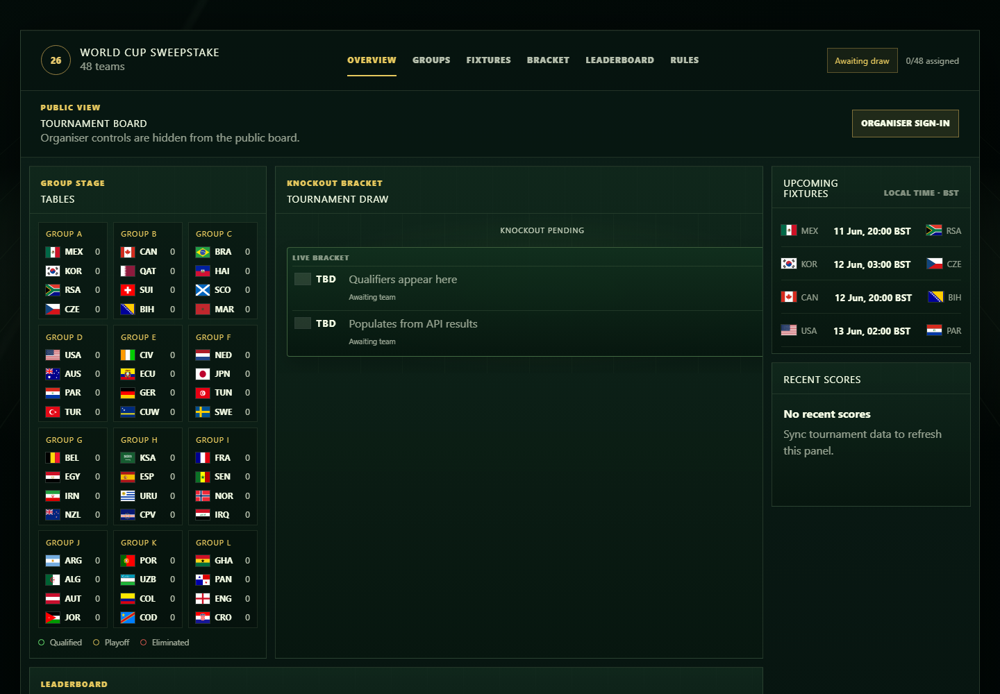
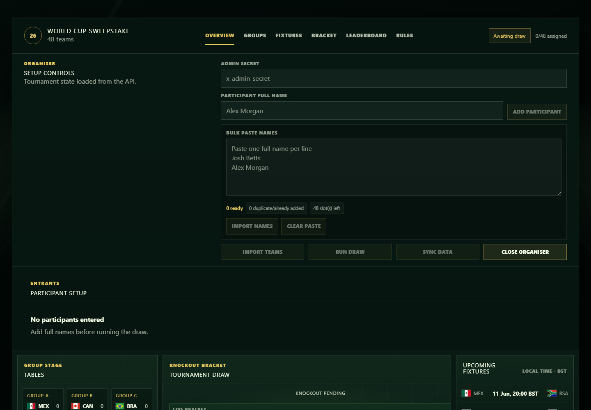

# World Cup Sweepstake

A public World Cup 2026 sweepstake site for assigning entrants to countries, following live tournament progress, and showing the draw, groups, fixtures, bracket, leaderboard, and rules in one place.

This is a private/social sweepstake project. It is not run by, endorsed by, or affiliated with FIFA, the FIFA World Cup, WC2026 API, Microsoft, or UNICEF. UNICEF is referenced only as the intended charity beneficiary for the donation portion of the sweepstake.

## Screenshots





## How the sweepstake works

- Entrants are added by the organiser before the draw.
- Full names are shown publicly exactly as entered by the organiser.
- Each entrant is randomly assigned one country.
- A country can have at most one entrant.
- The draw is run once, then locked permanently for transparency.
- If fewer than 48 people enter, unassigned countries stay visible but do not score.
- The leaderboard follows how far each assigned country progresses through the tournament.

## Tournament format

The 2026 tournament has 48 teams split into 12 groups of four. Each team plays three group matches. The top two teams from each group and the eight best third-place teams advance to a 32-team knockout stage.

Progression shown in the app follows:

| Stage | Meaning |
|---|---|
| Group stage | Team is active in the group phase |
| Round of 32 | Team qualified from the group phase |
| Round of 16 | Team reached the last 16 |
| Quarter-finals | Team reached the quarter-finals |
| Semi-finals | Team reached the semi-finals |
| Final | Team reached the final |
| Champion | Team won the tournament |
| Eliminated | Team exited at its final reached stage |

## Prizes and charity

The planned sweepstake has 48 entries at $10 each. Each entry contributes $5 to the prize pool and $5 to charity.

At 48 entries, that creates:

| Pot | Amount |
|---|---:|
| Prize pool | $240 |
| Charity contribution | $240 |
| Charity total after Microsoft matching | $480 |

Prize split:

| Category | Amount |
|---|---:|
| Winner | $90 |
| Runner-up | $60 |
| Third place | $30 |
| Group Stage Heroes | $30 split across three $10 prizes |
| Wooden Spoon | $30 |

The charity contribution is intended for UNICEF, with Microsoft matching used where eligible.

## Data and freshness

Football data comes from WC2026 API and is cached by the app before being shown publicly. The browser does not call the football data provider directly.

The deployed app refreshes match data during likely match windows and refreshes group standings several times per day, while staying inside the provider's free-tier request budget. The organiser can also trigger a manual refresh if needed.

## Organiser controls

Public visitors can view the board but cannot edit it. Organiser controls are hidden from the public view and require the organiser secret.

The organiser can:

- add entrants one at a time;
- bulk paste entrant names before the draw;
- remove entrants before the draw;
- refresh tournament data;
- run and permanently lock the draw.

Bulk entry expects one full name per line. Duplicate names are skipped, and imports are blocked if they would exceed the 48-team limit.

## Weekly digest drafts

The repository includes a scheduled GitHub Actions workflow that can generate a weekly sweepstake digest draft for organiser review. It reads the same cached public state used by the website, then opens a pull request with Markdown and plaintext files under `weekly-summaries/`.

During the group stage, the digest is group-first so each entrant is shown in the context of their team's group table. After group-stage qualification is complete, the digest switches to the full overall leaderboard. The workflow does not send emails automatically.

## Tech stack

- React, TypeScript, Vite, and Motion for the web app.
- Azure Functions for the API.
- Shared TypeScript domain models for tournament state, scoring, and progression.
- GitHub Actions for validation and deployment.
- Azure Application Insights host telemetry for operational monitoring.

## Local development

Recommended runtime: Node.js 22.

Install dependencies:

```powershell
npm install
```

Run the API locally in one terminal:

```powershell
Copy-Item apps\api\local.settings.example.json apps\api\local.settings.json
npm run dev:api
```

Run the web app in another terminal:

```powershell
npm run dev:web
```

The local app opens as the public board. Use the organiser sign-in control, or open `/?organiser=1`, to test organiser workflows with your local settings.

For demo data, use the documented local settings example and clear the local data file when switching seed modes so the API can recreate state cleanly.

## Validation

```powershell
npm run typecheck
npm run lint
npm run build
npm run package:api
npm run test:digest
npm run test:e2e
```

The Playwright suite starts isolated local API and web servers automatically. If Chromium is not installed yet, run:

```powershell
npx playwright install --with-deps chromium
```

## Security notes

- Do not commit real API keys, organiser secrets, storage credentials, or Azure deployment credentials.
- Keep write-capable organiser operations server-side.
- Do not expose football provider credentials in browser code.
- Do not log participant names, organiser secrets, or provider keys in telemetry.
